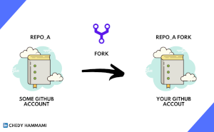
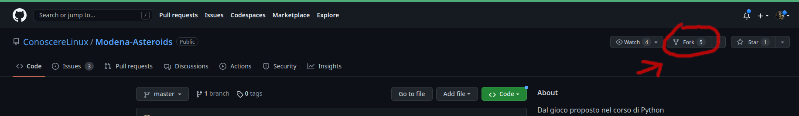
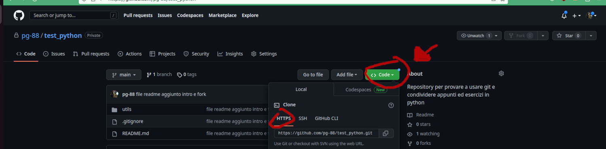
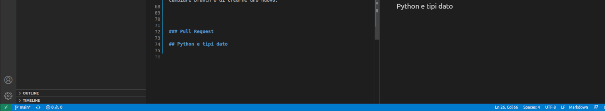
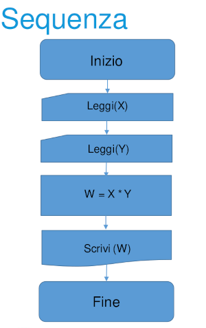
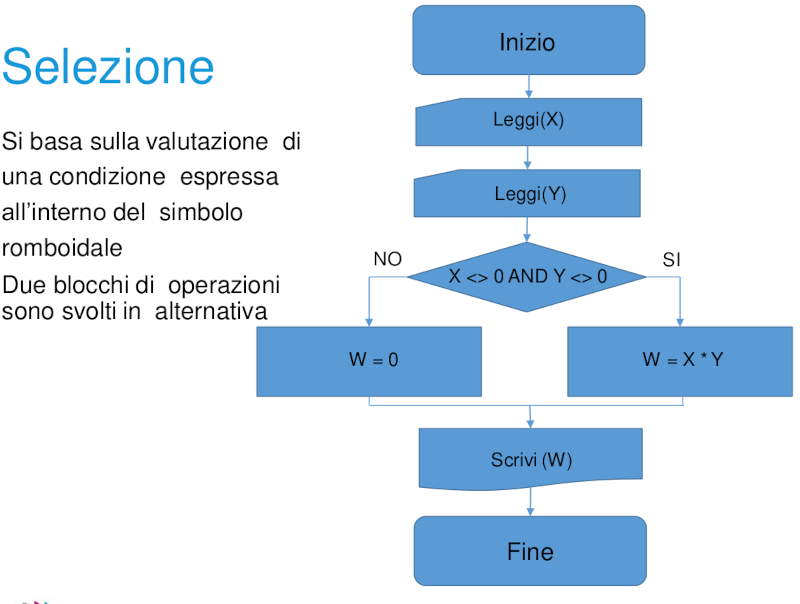

# Nelle Spire del Pitone
repository di prova per usare github e condividere appunti ed esercizi su python## Indice
- [Nelle Spire del Pitone](#nelle-spire-del-pitone)
  - [Come usare questa Repository](#come-usare-questa-repository)
    - [Disclaimer:](#disclaimer)
    - [Fork in github](#fork-in-github)
    - [Su visual studio code](#su-visual-studio-code)
    - [Clone](#clone)
    - [Branch](#branch)
    - [Pull Request](#pull-request)
  - [Python](#python)
    - [Python e tipi dato](#python-e-tipi-dato)
    - [Sequenza di istruzioni](#sequenza-di-istruzioni)
    - [Selezione](#selezione)
    - [Funzioni predefinite di python](#funzioni-predefinite-di-python)
    - [Definire funzioni in python](#definire-funzioni-in-python)
    - [Cicli For](#cicli-for)
    - [Liste e Dictionary](#liste-e-dictionary)
    
## Come usare questa Repository

Ho pensato di ricreare un caso d'uso di github il più simile possibile per poter fare delle prove e settare git in modo da poter condividere gli stessi files sorgente e poterci lavorare, ognuno sul suo pc, condividendo le modifiche sulla repository originale una volta che sono state controllate e accettate.

### Disclaimer:
>**In ogni caso, se questa procedura vi sembra inutilmente complessa, potete tranquillamente clonare la repository e lavorarci da remoto. Poi magari ci scambiamo i files a lezione.**
>
>comando:
>
>`git clone "link_del_repository"` 
>
>[vedi sezione clone](#clone)

Per fare questo sarà necessario fare 3 operazioni principali: 
- Fork della mia repository: questo permette di avere sul vostro account github una 'copia' della repository sulla quale potete fare modifiche 
- Clonare la repository sul vosrto sistema, per porterci lavorare offline con visual studio code 
- Branch: ovvero creare un ramo della repository su cui lavorare in modo da avere sempre il ramo main che rimane invariato. Si possono anche creare più rami (branch) per provare soluzioni alternative prima di caricare. La sequenza di comandi (di cui ci ha parlato Daniele) add, commit, push avviene sempre sul branch creato sul vostro repo dal main e non direttamente sul main
- Pull request ovvero una volta fatte le modifiche sulla vostra biforcazione della repository (il vostro fork) chiedete che le modifiche vengano *'assorbite'* dalla repository iniziale (in questo caso la mia su pg-88)

Esistono inoltre delle funzionalità di github che permettono la comunicazione tra utenti che collaborano allo stesso progetto, ovvero chi crea il repo può aprire delle issiue per dire quali sono le cose su cui ci sarebbe da lavorare (in questo caso magari esercizi nuovi). Chi collabora può commentare le singole issiue.

### Fork in github

Per creare un fork, bisonga prima di tutto entrare nell'account github (dal browser) quindi cercare la repository che ci interessa se è pubblica, oppure aprire il link che porta alla repository privata. 

A questo punto sulla pagina di github in alto a destra ci sono una serie di bottoni tra i quali c'è anche fork. 

Dallo screenshot si vede in alto a destra la foto del mio profilo perchè ho fatto l'accesso al mio github, a sinistra il nome dell'account (ConoscereLinux) e subito dopo il nome della repo (Modena-Asteroids) che stiamo forkando.

Dopo il fork avremo la stessa identica repository sul nostro account.
*Attenzione: il fork non si aggiorna da solo con la repository originale ma nel caso volessimo tenerla aggiornata è necessario sincronizzare le repository*

### Su visual studio code 

Prima di poter accedere ai repository remoti è necessario collegare git in locale con l'account github, ovvero attivare il sync con l'account github.

link alla guida VS code:
[set up git in vs code](https://code.visualstudio.com/docs/sourcecontrol/intro-to-git#_set-up-git-in-vs-code)
[setting sync](https://code.visualstudio.com/docs/editor/settings-sync)

### Clone

Il comando clone serve a copiare un repository dall'account github sul disco del pc in modo da poterci lavorare in locale.
Questo comando ricrea, in una cartella del sistema, tutti i files e le cartelle del progetto. Va lanciato da riga di comando stando attenti di essere nella cartella in cui vogliamo copiare il repository, il comando è 

`git clone https://github.com/nome_account/nome_repository` 

Il link esatto si trova nella pagina di github del progetto che vogliamo clonare, appare quando clicchiamo sul bottone verde "Code" selezionando il tab "HTTPS"

Sarebbe stato possibile fare direttamente il clone di una repository di un altro acconut, quindi senza fare prima il fork per portarlo sul mio accont, però in questo modo non mi è permesso modificare il progetto, mentre con il fork creo la mia biforcazione che posso modificare a piacimento e solo dopo che ho ultimato le modifiche posso chiedere che vengano integrate con il repository originale per diventare parte del progetto.
*Sarebbe possibile usare anche l'SSH per il clone ma questo richiede prima di settare il tunneling sul mio sistema operativo. Garantisce maggiore sicurezza ma la procedura è un po laboriosa.*

### Branch

Normalmente quando si lavora a una parte specifica dello sviluppo di un progetto, si crea un ramo apposito. Questo serve allo sviluppatore per avere maggiore liberta nell'andare a modificare diverse parti del codice, sapendo che nel caso si presentino problemi, sarà sempre possibile ricominciare da capo.
I branch servono anche a provare algoritmi diversi che magari arrivano allo stesso risultato ma uno potrebbe essere più efficiente di un altro (anche solo più leggibile). Una volta fatti i test del caso si può scegliere il branch migliore da mandare in revisione con la pull request.
Una volta clonato il repository si può creare un branch a partire da un altro branch esistente, se è il primo sarà un branch di main.
Da VS code si può cliccare in basso a sinistra sul nome del branch in cui siamo e si aprirà una tendina che ci permette di cambiare branch o di crearne uno nuovo.

Poi una volta fatte delle modifiche significative si può procedere ad aggiornare il branch della nostra repository in remoto (quindi da VS code, carico su github)
Questo si fa coi comandi

`git add .` 

>questo seleziona l'intera cartella del progetto, se vogliamo si possono caricare solo alcuni files selezionandoli con il comando add:
>
>`git add cartella_progetto/file1 cartella_progetto/file2`
>
>nell'esempio ho selezionato per l'upload solo file1 e file2

`git commit -m "commento che descrive cosa ho fatto"`

associa un commento alle modifiche, lo vedremo poi a fianco dei files caricati sulla pagina di github (è obbligatorio)

`git push`

fa iniziare l'upload.

### Pull Request

Se io sto collaborando a un progetto e finisco uno dei compiti che mi è stato assegnato, posso richiedere a chi coordina tutti, di prendere il codice che ho modificato (sulla mia fork) e ricongiurlo con il progetto principale (quello da cui ho fatto la fork). 

Questo meccanismo avviene con una *pull request* e se le modifiche vengono approvate da chi controlla il repository originale, viene fatto un *merge* ovvero le mie modifiche saranno assorbite nel progetto principale.

## Python

### Python e tipi dato
[vedi il notebook](./src/files_notebook/tipi_dato.ipynb)

##à Sequenza di istruzioni
Proviamo a ricreare con python alcuni diagrammi di flusso visti a lezione

per questo abbiamo bisogno di avere un input per il comando Leggi(x). Con python possiamo usare la funzione predefinita `input("Stringa che descrive cosa andrebbe inserito")`.

Con questa sintassi avremo la stringa stampata sul terminale e il programma sospenderà l'esecuzione per aspettare l'input. Una volta ricevuto, lo registrerà in una variabile.

[Esempio nel notebook sequenza](./src/files_notebook/sequenza.ipynb)

[Stesso esempio con file py](src/files_py/sequenza.py)

### Selezione

Qui si introduce la possibilità di biforcare l'esecuzione del codice in funzione del valore delle variabili passate (quindi in pratica di uno stato)

Per fare questo è necessario usare il costrutto `if` e almeno un operatore logico visto che dobbiamo confrontare il valore di 2 variabili

[Esempio sul notebook](src/files_notebook/selezione.ipynb)
[Stessa cosa sul file py](src/files_py/selezione.py)

### Funzioni predefinite di python

[QUI](./src/files_py/funzioni_pitone.py) trovi qualcosa sulla funzione print con uno spunto su come fare alcune prove.

### Definire funzioni in python

La parola chiava per definire le funzioni in python è def.

I nomi delle funzioni seguono le regole dei nomi variabilli (no numeri come primo carattere, caratteri alfanumerici non riservati a operatori).

Esistono delle convenzioni e di solito i nomi funzione vengono scritti in minuscolo con eventuale separazione delle parole con '_'. Questo non costituisce una regola ma è seguito più o meno da tutti in modo da rendere leggibile il codice degli altri.

Google ha raccolto queste best practice [qui](https://google.github.io/styleguide/pyguide.html).

Alcuni esempi sul notebook [def_pitone](./src/files_notebook/def_pitone.ipynb)

### Cicli For

### Liste e Dictionary 
